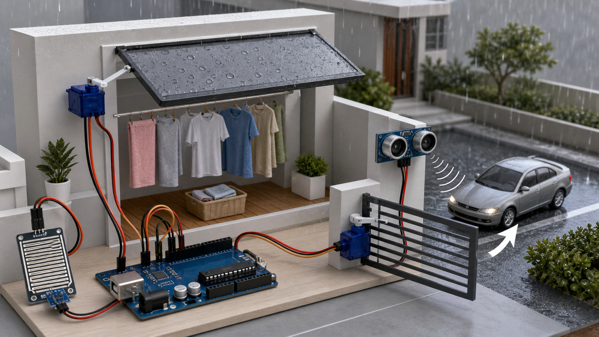
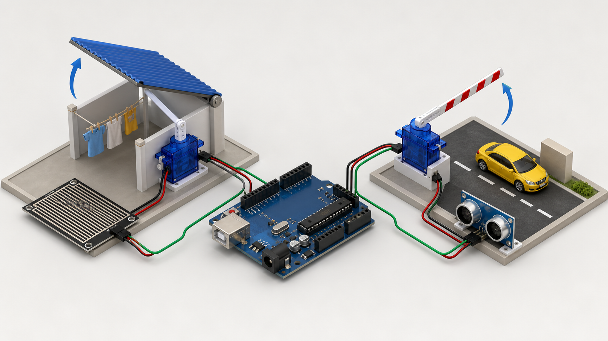

# Arduino Smart Home Automation System

An Arduino Uno prototype that automates two household mechanisms:

1. A rain-responsive roof that protects laundry and outdoor furniture.
2. A parking gate that opens when an approaching object is detected.

The project was developed for the Programming 1 course while learning C and C++.

> The images and video in this repository are AI-generated concept visualizations. They explain the implemented behavior and are not photographs or recordings of the original prototype.

## How it works

### Automatic rain protection

The Rain Sensor Module is read through analog pin A0. A value below 900 is treated as wet:

- Wet conditions move the roof servo to 0°, closing the protective roof.
- Dry conditions move the roof servo to 120°, reopening the roof.
- A stored rain-state flag prevents repeated servo commands while the condition remains unchanged.

### Automatic parking gate

The HC-SR04 ultrasonic sensor measures the distance to an approaching object:

- A valid measurement below 20 cm opens the model gate to 100°.
- The opening time is recorded with `millis()`.
- After five seconds, the gate returns to its 10° closed position.
- An ultrasonic timeout returns 999 cm so a missing echo does not open the gate.

## Technical highlights

- Analog and ultrasonic sensor input
- Two independently controlled SG90 servo motors
- State-based rain control
- `millis()`-based gate timing
- Ultrasonic timeout handling
- Servo `detach()` used after movement to reduce stationary jitter
- Angles and thresholds calibrated for the physical model

## Components

- Arduino Uno
- 2 × SG90 micro servo motors
- HC-SR04 ultrasonic distance sensor
- Rain Sensor Module
- Breadboard
- Jumper wires
- Power connections
- Physical roof and parking-gate model

See [Wiring and Calibration](docs/WIRING.md) for the complete pin map and calibrated values.

## Project contribution

This was a collaborative project developed with one partner. Daniel led the majority of the software implementation and system integration.

## Source code

The Arduino sketch is available at:

[`src/smart_home_automation.ino`](src/smart_home_automation.ino)

## Media

[Watch the AI concept video](assets/smart-home-concept-video.mp4)

## Documentation

- [Wiring and calibration](docs/WIRING.md)
- [Control algorithm](docs/ALGORITHM.md)
- [Technical notes and limitations](docs/TECHNICAL_NOTES.md)

## Known limitations

- The rain logic uses a single threshold rather than true two-threshold hysteresis.
- Servo movement still includes an 800 ms blocking delay.
- `pulseIn()` can block for up to 30 ms while waiting for an ultrasonic echo.
- An object that remains within 20 cm may cause the gate to reopen after it closes.
- The two servos may require a separate regulated 5 V supply in a more robust implementation.

## Possible next version

- Add true wet/dry hysteresis.
- Replace blocking servo movement with a timed servo state.
- Average multiple rain-sensor samples.
- Add serial diagnostics.
- Add a manual gate override and a safety sensor.
